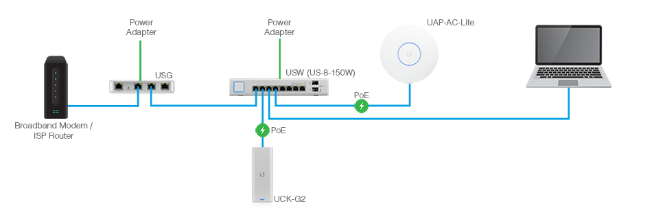

# Home Network

## Devices

- [UniFi Security Gateway (USG)](https://www.ui.com/unifi-routing/usg/)
- [UniFi Switch US-8-60W](https://www.ui.com/unifi-switching/unifi-switch-8/)
- [UniFi AP AC Pro](https://www.ui.com/unifi/unifi-ap-ac-pro/)
- [UniFi Controller running on Raspberry Pi 4](https://github.com/tschaffter/unifi-controller)
- CenturyLink Fiber Gigabit Optical Network Terminal (ONT)
- Computer used to setup the network

## Network topology

Connect the devices according to image below.

Here the Cloud Key (UCK-G2) represents the UniFi Controller that we run on a
Raspberry Pi.

Upon powering up any UniFi device, its status LED will start blink white. Wait
for the status LED of all UniFi devices to become solid white before moving to
the next step.

## Initial configuration of the USG

At this point, the computer used to configure the network may not internet
access, especially if the connection if provided by an internet service provider
(ISP) that uses PPPoE (Point-to-Point Protocol over Ethernet).

1. Go to the USG web interface: https://192.168.1.1
2. By pass the browser warning about `Potential Security Risk Ahead` (FireFox)
   by clicking on `Advanced...` and `Accept the Risk and Continue`
3. Configure PPPoe under `Settings` > `Configuration`
    - Connection Type: `PPPoE`
    - Username: `<username from CenturyLink>`
    - Password: `<password from CenturyLink>`
    - Preferred DNS: `8.8.8.8` (Google Public DNS)
    - Alternate DNS: `8.8.4.4` (Google Public DNS)
    - Use VLAN ID: `<VLAN ID from CenturyLink>`
4. Click on `Apply Changes`

The following message should appear:

> Congratulations! The Gateway is connected to the internet.

To confirm that the USG has now access to internet, ssh to the the USG
(`ssh ubnt@192.168.1.1`, password: `ubnt`) and run the command `ping 1.1.1.1`.

### Change the subnet later

A good practice in terms of security is to never use default value for username,
password and IP addresses. Thus, it is recommended to change the primary subnet
of the network so that the IP address of the USG becomes `192.168.<subnet ID>.1`
where `<subnet ID>` can take any value you want between 1 and 255.

Though the USG interface allows to change the subnet, it is recommended to do so
using the UniFi controller AFTER adopting all the devices.

## Check that all the devices are detected by the USG

The USG interface should list the following devices as well as their IP
addresses.

- USG
- UniFi controller
- UniFi AP
- Computer used to setup the network

## First login into the UniFi controller

Before navigating to the web interface of the controller, set the field `Inform URL`
in the USG dashboard to the value `http://<controller_ip>:8080/inform`
and click on `Apply Changes`. Leave the dialog titled `Waiting for adoption`
open. Then, open a new tab in your browser and:

1. Go to the web interface of the controller: `https://<controller_ip>:8443`
2. On the setup page 1:
    - Controller Name: `unifi-controller`
    - Check the checkbox and click on `Next`
3. On the setup page 2: We are given the choice to login with an Ubiquiti account
   or with a local account. The later is considered more secure. Also the controller
   may not have access to the internet at this point of the setup, in which case
   creating a local account is the option valid option. If internet access is
   available, the Ubiquiti option can be selected if the controller needs to be
   accessible remotely (i.e. from outside this private network).
    - Click on `Switch to Advanced Setup`
    - Disable `Enable Remote Access` and `Use your Ubiquiti account for local access`.
    - Fill in the form to create a local account
    - Click on `Next`
4. On the setup page 3:
    - Leave both options turned on (`Automatically optimize my network` and
    `Enable Auto Backup`).
    - Click on `Next`
5. On the setup page 4:
    - The three UniFi devices should be listed (USG, Switch and AP)
    - Do not select any devices
    - Click on `Next`
6. On page Step 5 of 6:
    - Set the wifi name and password
    - Leave the option `Combine 2 GHz and 5 GHz WiFi Network Names into one`
    unchecked (preferred)
    - Click on `Next`
7. On page Step 6 of 6:
    - Verify the information and click on `Finish`

After a brief loading screen, you should now be presented with the controller
dashboard.

## Adopt UniFi devices

Navigate to the page `Devices` of the controller dashboard. This page should
list the three UniFi devices with the status `Pending Adoption`.

### Adopt the USG

1. Click on the USG item to open a menu on the right side of the page.
2. Click on `Adopt`.
3. Go back to the USG web interface and close the open dialog by clicking on
   the button `Confirm`.
4. In the controller dashboard, the status of the USG should now be `Provisioning`
   and the status LED of the USG should have became solid blue. After a couple
   of minutes, the USG status should become `Connected`.

### Get internet access

All the devices can get internet access now that the controller has adopted
the USG.

1. Computer: Simply turn disable/enable the Ethernet connection
2. AP: Power off/on
3. Controller: Ssh to it then `sudo reboot`

### Difficulty adopting devices

One reason may be that the `Inform URL` of the device is ill defined. Ssh into
the device to check and set the `Inform URL` if needed.

1. `ssh ubnt@<device_ip>` (default password valid before adoption: `ubnt`)
2. Check the value of the `Inform URL` with the command `info`
3. Set `Inform URL`:

        set-inform http://<controller_ip>:8080/inform

### Logging into devices after their adoption

The SSH credentials of the UniFi devices are redefined during their adoption.
The new credentials can be found from the controller interface under
 `Settings` > `Network Settings` > `Device Authentication`.

### Manual firmware update

The controller starts proposing update for the firmware of the UniFi devices
after their adoption. A manual update of the firmware is still possible. Simply
ssh into the device and run the command below (see [UniFi Downloads page](https://www.ui.com/download/unifi/).).

    upgrade https://dl.ui.com/unifi/firmware/<device>/<version>.tar`

### Adopting the UniFi switch and AP

Initiate the adoption procedure from the controller. Ssh into the device to [set
the Inform URL](#difficulty-adopting-devices).

## Change the primary subnet

It is recommended to use a subnet different from the default one (192.168.1.x)
for enhanced security. From the controller interface, go to `Settings` >
`Networks` > `Edit` the network named `LAN`:

- Gateway/Subnet: `192.168.<subnet>.1/28`
- Click on the button `Update DHCP Range`
- Click on `Save`

Wait a couple of minutes and then tries to logging back into the controller
interface now available at the address `192.168.<subnet>.1`. Disconnect and
reconnect all the devices on the network, including the computer used to
configure it, to ensure that they obtain an IP from the new subnet. Go to the
`Devices` page of controller and check that all UniFi devices are correctly
detected. If the controller tries to re-adopt a device or if the status of the
device is not `Connected`, [ssh into the device](#logging-into-devices-after-their-adoption)
and make sure that the [Inform URL is set to the new IP of the controller](#difficulty-adopting-devices).

## Contributing change

Please read the [`CONTRIBUTING.md`](CONTRIBUTING.md) for details on how to
contribute to this project.